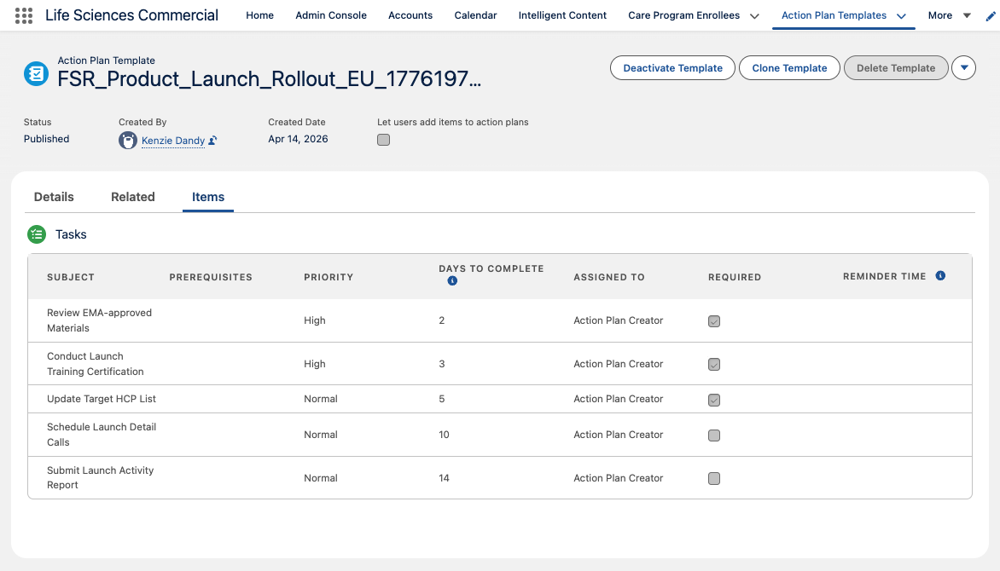
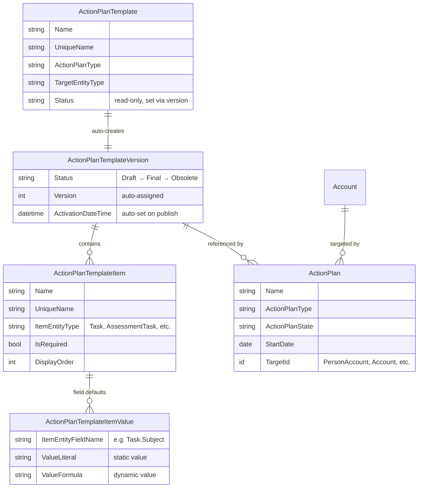
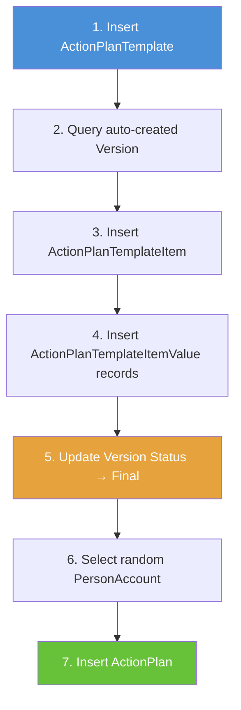
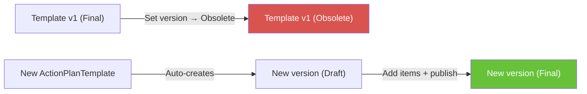

# Load Action Plan Templates



Run the anonymous Apex script in this repo to understand how Action Plan Templates are structured and loaded via the Salesforce backend API. The script walks through the full lifecycle: creating a template, adding items, **publishing** (by setting the _version_ status to `Final` — not the template status, which is read-only), and generating an Action Plan against a random PersonAccount.

A common gotcha is attempting to publish by updating `ActionPlanTemplate.Status` directly — this field is **not writable**. The correct approach is to update `ActionPlanTemplateVersion.Status` to `Final`, which automatically propagates to the parent template.

> **Looking for ready-made templates?** See [EXAMPLES.md](EXAMPLES.md) for 40 pre-built Action Plan Templates across 4 Life Sciences personas (Field Sales Rep, MSL, KAM, Field Reimbursement Manager).

## Prerequisites

- Salesforce CLI (`sf`) authenticated to your target org
- Action Plans feature enabled in the org
- PersonAccount records (for the default target entity type)

## Usage

```bash
sf apex run --file scripts/create_action_plan_template.apex
```

## What the Script Does

1. **Creates an `ActionPlanTemplate`** with `ActionPlanType = 'Industries'` and `TargetEntityType = 'Account'`
2. **Queries the auto-created `ActionPlanTemplateVersion`** — the platform creates Version 1 automatically on template insert; do NOT insert a version manually
3. **Creates an `ActionPlanTemplateItem`** (Task type) on the version
4. **Creates `ActionPlanTemplateItemValue` records** for Task fields (`Subject`, `Priority`, `ActivityDate`, `IsReminderSet`, `ReminderDateTime`)
5. **Publishes the template** by setting `ActionPlanTemplateVersion.Status = 'Final'`
6. **Selects a random PersonAccount** and creates an `ActionPlan` against it

## Object Hierarchy



## Script Flow



## Key Findings

| Topic | Detail |
|-------|--------|
| Version is auto-created | Inserting a second version throws `INVALID_INPUT` |
| Template.Status is read-only | Control status via the *version*, not the template |
| Items required before publish | Publishing with zero items fails with `FIELD_INTEGRITY_EXCEPTION` |
| Task.ActivityDate | Set via `ValueFormula` (e.g. `StartDate + 2`) — required for items to display on the template's Items tab |
| Status transitions are one-way | `Draft → Final → Obsolete` — cannot revert from Final to Draft |
| Published versions are immutable | Cannot add/update/delete items on a Final version |
| ActionPlanType values | `Industries`, `Retail`, `KAM` — LSC uses `Industries` for standard plans and `KAM` (Key Account Management) for KAM plans |

## Creating a New Version of a Template

The platform enforces **one version per template** via the API. Even after setting the existing version to `Obsolete`, inserting a second `ActionPlanTemplateVersion` record on the same template throws:

> `INVALID_INPUT: You can't add more than one version to an action plan template.`

The UI's "New Version" button uses an internal platform mechanism not exposed through standard DML or REST API.

**Backend workaround:** To effectively create a "new version," create a new `ActionPlanTemplate` entirely and set up its auto-created version with the updated items. If you need to retire the old template, set its version to `Obsolete` first.


